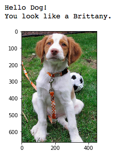
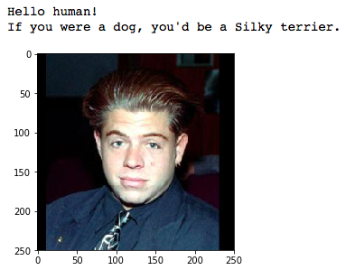

# Dog Breed Classifier
Deep Learning Nanodegree Project 2

## Project description
In this project, we'll  implement an algorithm that could be used as part of a mobile or web app. Our code will accept any user-supplied image as input. If a dog is detected in the image, it will provide an estimate of the dog's breed. If a human is detected, it will provide an estimate of the dog breed that is most resembling. The image below displays potential sample output of our finished project . 

In this real-world setting, we'll need to piece together a series of models to perform different tasks; for instance, the algorithm that detects humans in an image will be different from the CNN that infers dog breed. There are many points of possible failure, and no perfect algorithm exists. This imperfect solution will nonetheless create a fun user experience!

## Getting started

### Requirement 
For information regarding the requirement packages check the file requirement.txt. To train the network, we need an access to CUDA supported GPU.

### Notebook
The whole project is self-contained with necessary outputs and explainations in the dog_app.ipynb notebook.

### Datasets
There are two datasets used in the project.
* DogImages- It has a total of 8351 dog images of 133 categories.
* lfw- It has a total of 13233 human faces.
